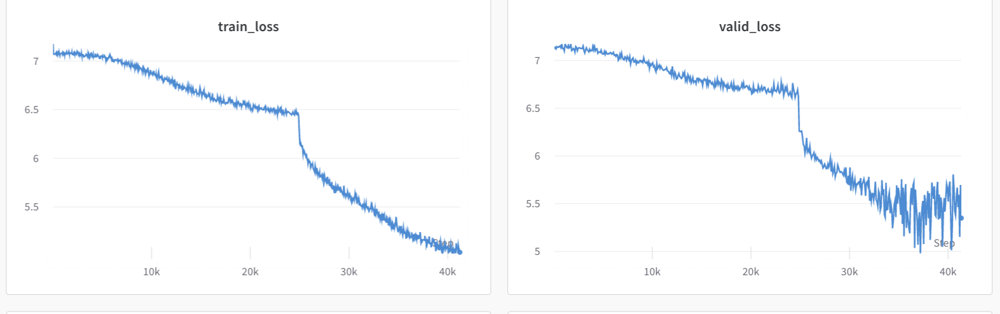
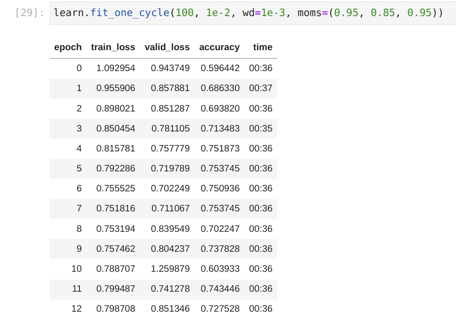

# Rice Disease Classification through Self-Supervised Pretraining
*Brian Muhia, July 2022*

In this repository, we train a self-supervised encoder on images from 
[this Zindi challenge ](https://zindi.africa/competitions/microsoft-rice-disease-classification-challenge/), 
and fine-tune it on the challenge task of classifying diseases in rice leaves. In the dataset, each RGB image is 
paired with a corresponding RGNIR (RG-Near-Infra-Red) image of the same plant. Each image has a **single** label from 
the set `S = ['brown', 'blast', 'healthy']`. We want to make this, and other future challenges on this type of 
dataset simpler by utilising **weight sharing**: representing both images of the same object with the same weights, 
even if they're coming from two different cameras. After that, we can use those weights for the downstream task 
of classifying diseases. We can achieve this through self-supervised learning. For this task, we leave the labels 
alone and focus on training a model of the structure **{ImageTensor , ImageTensor}**. 

In the standard self-supervised learning setup for computer vision, we take a single image from the training set, 
make a copy, suitably augment that copy, then train a neural network to **minimize the distance between copies**. 
When such a model is well trained to convergence, we have a **task-agnostic encoder** whose representations can be
used for further downstream tasks by transfer learning. Since we have two cameras pointing at plants, we get two 
images per sample in the training set. We can therefore construct any self-supervised learning task by assuming 
the image's copy is given, and that the difference in appearance coming from the NIR channel might as well be 
another augmentation of the RGB image. The other augmentations from the [SWAV paper/implementation](https://arxiv.org/abs/2006.09882) are kind of a bonus but it would better to ablate them. We're also releasing one pretrained encoder 
from the best run, based on **XResnet-34**, which we're calling **mwalimu-128**, available [here on Google Drive](https://drive.google.com/drive/folders/1lV7Zl5XcI1dov6FkEgr6rmxES14Hc-xF). Another one is in progress, based on Res2Net50 
which will be made available soon.

## installation
mamba install -c fastai fastai
pip install jupyter jupyterlab self-supervised wandb

### Read the Notebooks for more
Pretraining: self-supervised-learning-swav-eda.ipynb
Classification: classifier.ipynb

## mwalimu-128 details
- architecture: xresnet34
- image size: 128px
- bs: 32
- training time: Approx. 2.5 hrs
- gpu: Nvidia GeForce RTX 3070

### Training loss curve

About 60% of the way into the training run `mwalimu-128`, the loss dropped dramatically, meaning the model escaped a saddle point that enabled it to solve the task significantly better.

## Showcasing early generalization

During the transfer learning step of this challenge, early in training we observe that validation loss is lower than
training loss, a sign of good generalization properties for this dataset. In the current set of experiments, the
phenomenon disappears in later steps, and this observation survives for even more of the training time of a model
if the batch size is higher.

Acknowledgments: @keremturgutlu for https://github.com/keremturgutlu/self_supervised, this would have not been possible so quickly without his work.